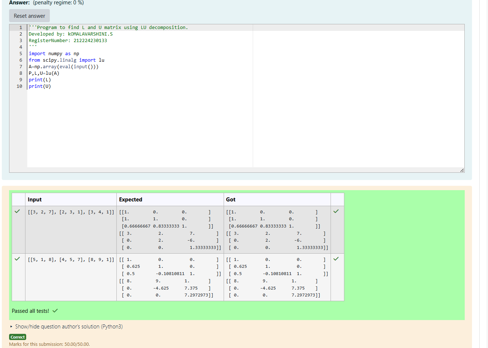
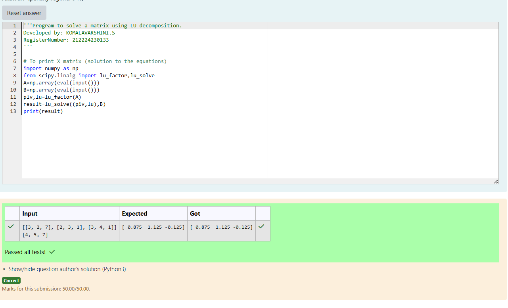

# LU Decomposition 

## AIM:
To write a program to find the LU Decomposition of a matrix.

## Equipments Required:
1. Hardware – PCs
2. Anaconda – Python 3.7 Installation / Moodle-Code Runner

## Algorithm
(i) To find the L and U matrix:

Step 1: Import the required libraries.
Step 2: Accept a square matrix as input and convert it to a NumPy array.
Step 3: Apply the lu() function to decompose the matrix into:
Step 4: Display the L and U matrices using print().
Step 5: End the program.
(ii) To find the LU Decomposition of a matrix:
Step 1: Import the required libraries:
Step 2: Input the coefficient matrix A and the constant matrix B from the user, and convert them to NumPy arrays.
Step 3: Perform LU decomposition of matrix A using lu_factor(A), which returns the LU matrix and pivot indices.
Step 4: Solve the system of equations AX = B using lu_solve((lu, piv), B) to get the solution matrix X.
Step 5: Display the result (solution matrix X) using print().
Step 6: End the program.

## Program:
(i) To find the L and U matrix.

```

Program to find the L and U matrix.
Developed by: KOMALAVARSHINI.S
RegisterNumber: 212224230133

import numpy as np
from scipy.linalg import lu
A=np.array(eval(input()))
P,L,U=lu(A)
print(L)
print(U)

```
(ii) To find the LU Decomposition of a matrix
```

Program to find the LU Decomposition of a matrix.
Developed by: KOMALAVARSHINI.S
RegisterNumber: 212224230133

# To print X matrix (solution to the equations)
import numpy as np
from scipy.linalg import lu_factor,lu_solve
A=np.array(eval(input()))
B=np.array(eval(input()))
piv,lu=lu_factor(A)
result=lu_solve((piv,lu),B)
print(result)

```

## Output:





## Result:
Thus the program to find the LU Decomposition of a matrix is written and verified using python programming.

git push